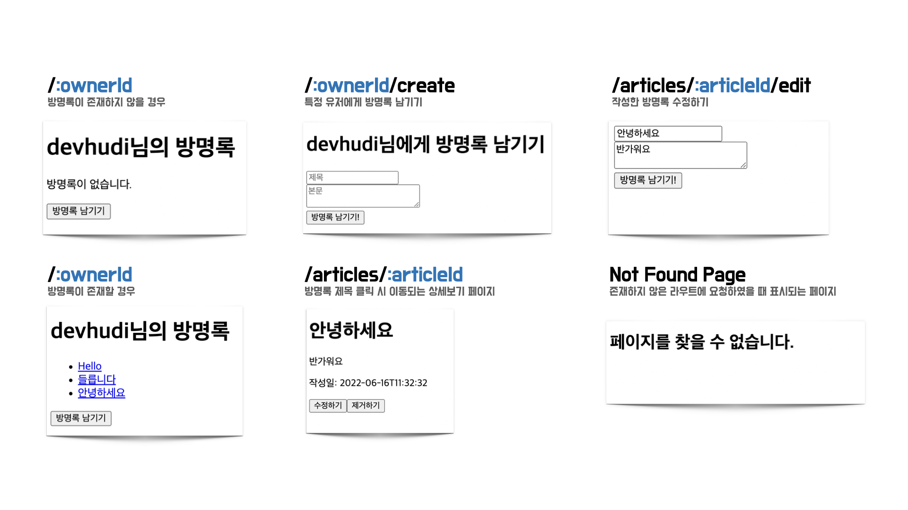
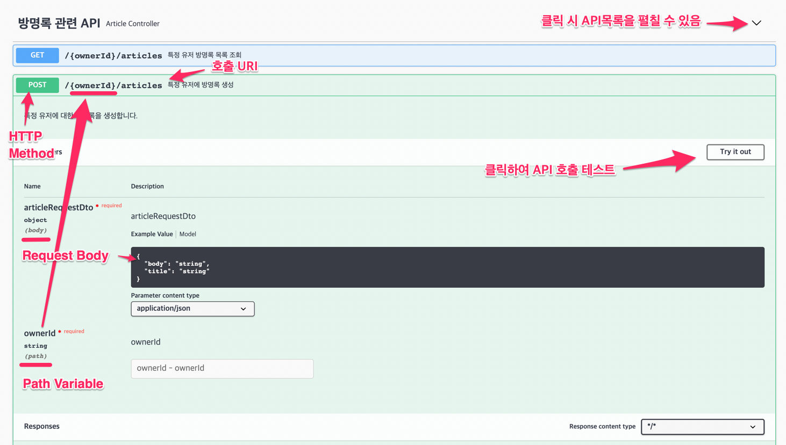

# 멋쟁이 사자처럼 10기 FE 5주차 사전과제

이번 사전 과제를 통하여 React Router 를 이용한 클라이언트 사이드 라우팅, Axios 를 이용한 REST API 사용 두가지를 학습합니다.

## 🔍 필수 수강 강의

- Codelion '프론트엔드 트랙 - React'
  - 챕터4. 리액트 라우터 활용하기& 폼제출 & memo
  - 챕터6. REST api 연동 axios

| ⚠ 위 두가지 강의를 수강하지 않으면 사전 과제를 진행하기 어렵습니다.

## ⚙️ 실습 준비

1. 지금 보고 계신 레포지토리를 Fork 합니다.
2. Fork 한 자신의 레포지토리를 Git Kraken 을 사용하여 Clone 합니다.
3. Clone 받은 소스코드를 VS Code 에서 엽니다.
4. 터미널에서 `npm install` 을 실행하여 의존성 모듈을 설치합니다.
5. 터미널에서 `npm start` 을 실행하여 로컬 개발서버를 실행합니다.

## 🤔 무엇을 만드나요?

간단한 방명록 웹 어플리케이션을 개발합니다. 단, 이제는 지금까지 개발한 한페이지 어플리케이션이 아닌, 여러 페이지로 구성된 웹 애플리케이션을 개발합니다.

또한, 지금부터는 실제 동작하는 백엔드 서버와 데이터베이스가 제공됩니다. 여러분은 사전에 개발된 API 서버와 여러분의 React 어플리케이션을 연동해야합니다.

### 구현 요구 사항

> 컴포넌트 스타일링은 생략합니다. 라우팅과 REST API 호출 로직에 집중해주세요.

> 👉 URL에서 `:` 로 시작하는 부분은 Param 을 의미합니다.

- http://localhost:3000/:ownerId: `ownerId` Param에 해당하는 유저의 모든 방명록 목록을 조회할 수 있는 페이지.

  해당 유저의 방명록이 존재하지 않으면, '방명록이 없습니다.' 등의 메세지로 유저에게 피드백을 제공합니다. 제목만을 출력하며, 제목을 클릭하면 해당 글을 상세하게 볼 수 있는 페이지로 이동합니다.

- http://localhost:3000/articles/:articleId : 방명록의 글 상세보기 페이지. 제목 뿐 아니라 내용과 작성일까지 확인할 수 있습니다. 수정하기와 제거하기 버튼이 위치해있습니다.
- http://localhost:3000/:ownerId/create : `ownerId` 에 해당하는 유저에게 방명록을 작성할 수 있는 폼 페이지.
- http://localhost:3000/articles/:articleId/edit : 방명록의 글을 수정할 수 있는 폼 페이지.
- 기타 라우트 : 존재하지 않는 페이지이므로 '페이지를 찾을 수 없습니다.' 등의 메세지로 유저에게 피드백을 제공합니다.

> 실제 동작하는 예제 웹사이트를 확인하고 싶으면 https://starlit-tapioca-4d24d2.netlify.app/devhudi 로 접속해서 확인해주세요.

## 📒 API 정보

[API 소스코드](https://github.com/Likelion-Inha-10/fe-guest-book-api)

- API HOST: https://guestbook.devhudi.xyz
- API DOCS: https://guestbook.devhudi.xyz/swagger-ui/index.html

API 호출 방법을 확인하기 위해 반드시 API DOCS 페이지를 정독해주세요.

> API DOCS 페이지는 Swagger를 사용하여 빌드되었으며, API의 상세 스펙을 확인할 수 있고 Try it out 버튼으로 실제로 API를 호출해볼 수도 있습니다.

## 🗯 예제 코드

너무 어렵나요? 걱정하지 마세요! 어려움을 겪는 분들을 위해 언제든지 참고할 수 있는 미리 완성된 예제를 제공합니다. https://github.com/Likelion-Inha-10/fe-week5-pre-assignment-example 에서 완성된 예제 코드를 참고하여 과제를 수행해주세요.

## 📘 참고자료

- [React Router v6 공식문서 (영어)](https://reactrouter.com/docs/en/v6/getting-started/tutorial)
- [Velopert님의 RR v6 튜토리얼 (한국어)](https://velog.io/@velopert/react-router-v6-tutorial)
- [REST API가 무엇인가요? (한국어)](https://hudi.blog/rest-api/)
- [Axios 공식문서 (한국어)](https://axios-http.com/kr/docs/intro)
- [Axios 러닝 가이드 (한국어)](https://yamoo9.github.io/axios/guide/usage.html#get-%EC%9A%94%EC%B2%AD)

## 🤗 메인 과제 미리보기

https://github.com/Likelion-Inha-10/fe-gallery-project
